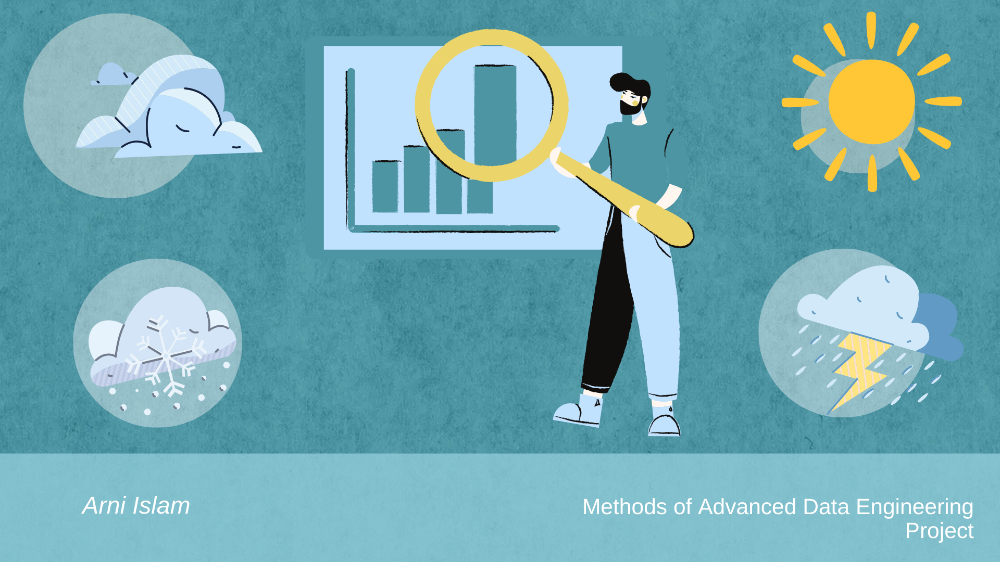

> *Within this repository, you will discover a data engineering and data science project, along with exercises leveraging open data sources as an integral component of the MADE ([Methods of Advanced Data Engineering](https://oss.cs.fau.de/teaching/specific/saki/)) course. The course was conducted by the FAU Chair for Open-Source Software (OSS) during the Winter '24 semester. This repository has been forked from the [jvalue-made-template](https://github.com/jvalue/made-template) repository.*

# Analyzing the Correlation between Supershop Sales and Weather Patterns in Myanmar (Yangon, Mandalay, Naypyitaw): A Data-Driven Investigation


<figure>
    
</figure>


## Project Overview

Welcome to the *"Analyzing the Correlation between Supershop Sales and Weather Patterns in Myanmar"* project repository. In the retail landscape, particularly within supermarkets, external factors like weather conditions play a pivotal role. This project delves into the intricate relationship between temperature patterns and Supershop sales. The investigation specifically focuses on the impact of temperature on Supershop sales in three major cities in Myanmar: Yangon, Mandalay, and Naypyitaw. Understanding this correlation holds the potential to revolutionize conventional strategies, providing businesses with insights to enhance decision-making through predictive analytics.

## Project Goals

The primary objectives of this project include answering the following questions:

1. **Temperature Variation (Jan-Mar 2019):** Explore the temperature variances in Yangon, Mandalay, and Naypyitaw cities during the period from January to March 2019.

2. **Supermarket Sales Trends:** Analyze and compare Supershop sales data in these three cities within the same timeframe, identifying patterns or fluctuations.

3. **Temperature-Sales Correlation:** Investigate whether and to what extent temperature influences supermarket sales, shedding light on consumer behavior dynamics.

You can find the project report [here](/project/report.ipynb). The repository also contains [slides](/project/slides.pdf) and [video](/project/presentation-video.md) presentation of the project. 

To run the project on your local machine, ensure that you have the necessary libraries installed. Follow the steps outlined in the [Project setup](#project-setup) section for the installation process.

## Key project files and their functions:

* `project/pipeline.sh`: It will run an automated ETL pipeline that creates a SQLite database named analysis.sqlite that contains required data.
* `project/tests.sh` : It will run the test cases for the ETL pipeline.

Feel free to navigate through the report to gain a comprehensive understanding of the project's objectives, methods, results, and potential implications. We encourage collaboration, contributions, and adaptations of these findings for further exploration. Let's dive into the intriguing intersection of Supershop sales and weather patterns in Myanmar!

## Project Setup

1. Clone the repository:

```
git clone git@github.com:islam15-8789/made-template.git
```

2. Create virtual environment:

```
python3.11 -m venv venv
```

3. Activate the virtual environment:

```
source .venv/bin/activate
``` 

4. Install requirements:

```
pip install -r requirements.txt
```

## etl-pipeline-runner
An ETL (Extract Transform Load) pipeline has been employed a to gather the required data for this project. Throughout the project, a collaborative effort has been made to initiate an [open-source Python package](https://github.com/prantoamt/etl-pipeline-runner) for executing ETL pipelines. Take a moment to review our contributions and share your feedback. Your input is highly appreciated.

### Course Exercises
Throughout the semester, we engaged in exercises that required the utilization of both Python and [Jayvee](https://github.com/jvalue/jayvee). Automated feedback for these exercises is facilitated through a GitHub action defined in .github/workflows/exercise-feedback.yml.

Here are the exercise files:
- [exercise1.py](/exercises/exercise1.py)
- [exercise2.jv](/exercises/exercise2.jv)
- [exercise4.jv](/exercises/exercise4.jv)
- [exercise5.py](/exercises/exercise5.py)

The exercise feedback is triggered each time we make changes to files in the exercise/ directory and push those changes to the GitHub repository. To view the feedback, access the latest GitHub Action run, and navigate to the exercise-feedback job and Exercise Feedback step.