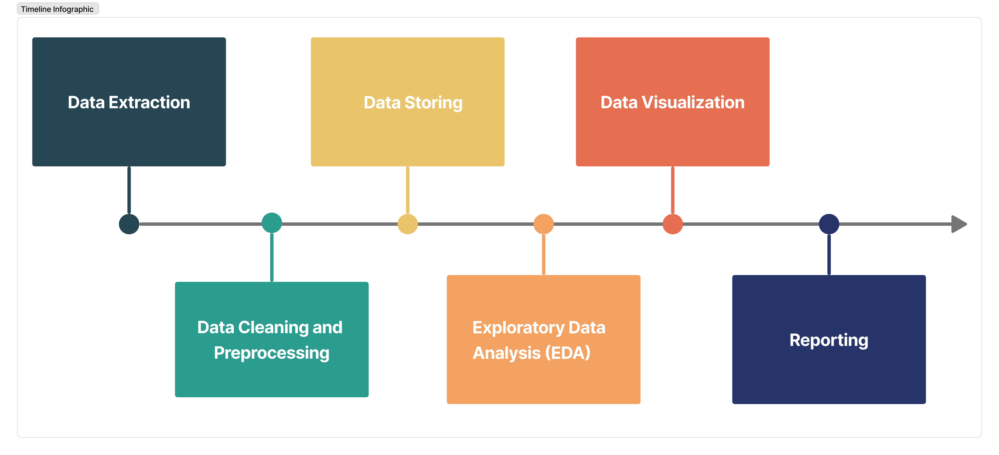

# Navigating Germany's Rental Landscape for International Students

## Project Overview

The project aims to analyze data concerning international students and rental properties in bayren, Germany. By examining this information, the project seeks to provide valuable insights to newcomers, helping them identify cities in bayren, Germany with the most favorable accommodation options and thus facilitating their transition to the country.

## Datasets

The analysis will be performed using two separate datasets.

1. Datasource1: Foreign students in Germany
   Metadata URL: https://data.europa.eu/data/datasets/https-www-datenportal-bmbf-de-portal-2-5-34

2. Datasource2: Immoscout24 dataset
   Metadata URL: https://www.kaggle.com/datasets/corrieaar/apartment-rental-offers-in-germany

This dataset comprises information about international students admitted to degree programs in  bayren Germany over a specific time period. It includes data on the students' nationalities, degree programs, admission dates, and other relevant attributes.

## Project Flow

## Project Report

The provided link offers a comprehensive report detailing the entire process of analysis and visualization: [Project Report](/project/report.ipynb).